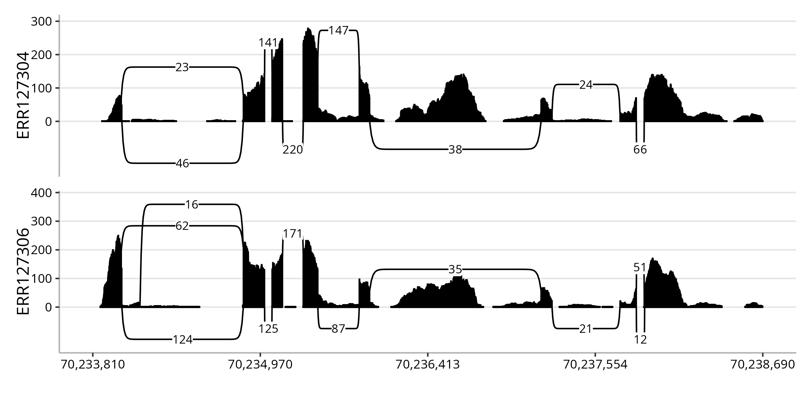

# spliceTerrain

`spliceTerrain` is an R package for visualising RNA-seq splice patterns as sashimi plots.
It combines coverage, splice junction arcs, and optional annotation tracks to show how transcripts are assembled across a genomic region.
`spliceTerrain` was designed to integrate seamlessly within the Bioconductor ecosystem, keeping the workflow entirely within R to support reproducible, customisable splicing visualisation for exploratory analysis, reporting, and publication-quality figures.

## Installation

`BiocManager` is recommended for the installation of `spliceTerrain`.
The package is currently under development and can be installed from GitHub.

```r
if (!require("BiocManager", quietly = TRUE))
    install.packages("BiocManager")
BiocManager::install("baerlachlan/spliceTerrain")
```

## Quick start

At a minimum, we require BAM file paths and a genomic interval to plot.

Here we use BAM files from the `RNAseqData.HNRNPC.bam.chr14` package as example data, selecting two of these files to showcase `spliceTerrain`.
In the most simple case, a genomic interval can be specified as a character vector of length 1.
That's all we need to build a simple sashimi plot!

```r
library(spliceTerrain)
library(RNAseqData.HNRNPC.bam.chr14)
bams <- RNAseqData.HNRNPC.bam.chr14_BAMFILES[c(7, 1)]
region <- "chr14:70,233,810-70,238,690"
spliceTerrain(bam = bams, region = region)
```


