# Creating Sashimi-Style Plots with spliceTerrain

## Setup

`BiocManager` is recommended for installing the packages required in
this vignette. `BiocManager` handles installation from Bioconductor,
CRAN and GitHub repositories.

``` r

if (!"BiocManager" %in% rownames(installed.packages()))
    install.packages("BiocManager")
pkgs <- c(
    "spliceTerrain", "RNAseqData.HNRNPC.bam.chr14", "EnsDb.Hsapiens.v75",
    "AnnotationFilter", "ensembldb", "GenomicRanges", "scales", "pander",
    "GenomeInfoDb"
)
BiocManager::install(pkgs, update = FALSE)
```

Now we can load the packages used below.

``` r

library(spliceTerrain)
library(RNAseqData.HNRNPC.bam.chr14)
library(EnsDb.Hsapiens.v75)
library(AnnotationFilter)
library(ensembldb)
library(GenomicRanges)
library(scales)
library(pander)
library(GenomeInfoDb)
```

## Quick start

At a minimum,
[`spliceTerrain()`](https://baerlachlan.github.io/spliceTerrain/reference/spliceTerrain-methods.md)
needs BAM file paths and a genomic interval. Here we use BAM files from
`RNAseqData.HNRNPC.bam.chr14`, selecting one HNRNPC knockdown sample and
one control sample. The region can be supplied as a single character
string.

``` r

bams <- RNAseqData.HNRNPC.bam.chr14_BAMFILES[c(7, 1)]
region <- "chr14:70,233,810-70,238,690"

spliceTerrain(bam = bams, region = region)
```

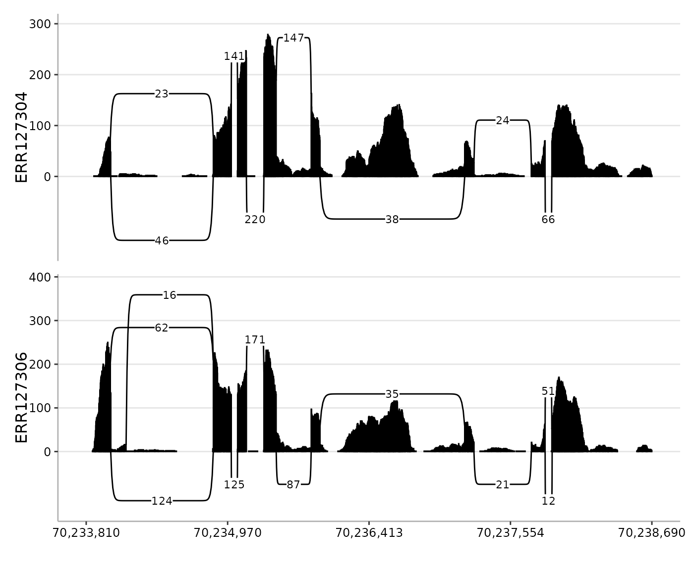

## Introduction

Sashimi plots visualise RNA-seq alignments across a genomic interval.
They combine per-base read coverage with arcs representing reads that
span splice junctions. This makes them useful for inspecting transcript
structure, exon usage, alternative splice sites, intron retention, and
differences in junction usage between samples.

### Motivation

Several excellent tools already exist for generating sashimi-style
visualisations, including genome browsers, command-line tools, and
workflow-specific plotting utilities. `spliceTerrain` is intended to
complement these approaches by providing an R-native interface that
works naturally within the Bioconductor ecosystem and reproducible
analysis documents.

In many RNA-seq analyses, regions of interest, annotations, and genomic
features are already represented as `GRanges` or `GRangesList` objects.
`spliceTerrain` accepts these objects directly, making it
straightforward to move from a differential splicing result or genomic
annotation to a sashimi plot inside the same R session. For users who
want more control, processed coverage and junction data can also be
returned, inspected, modified, and replotted.

## Complete guide

The following sections build up aspects of a more complete plot and
introduce the main options available in
[`spliceTerrain()`](https://baerlachlan.github.io/spliceTerrain/reference/spliceTerrain-methods.md).
The examples continue to use the HNRNPC chr14 BAM files from the quick
start.

### Input BAM files and regions

The `bam` argument is a character vector of indexed BAM file paths. If
the vector is named, those names are used as sample labels in the plot.
If it is unnamed, labels are derived from the BAM file names. BAM files
must be indexed for region-restricted import. Index files should be
discoverable by `Rsamtools` using standard same-directory naming,
typically `file.bam.bai`.

``` r

bams <- RNAseqData.HNRNPC.bam.chr14_BAMFILES[c(7, 1)]
names(bams) <- c("HNRNPC knockdown", "Control")
```

The `region` argument can be a character string, a `GRanges`, or a
`GRangesList`. Character regions may use comma-separated coordinates,
such as `"chr14:70,233,810-70,238,690"`. For Bioconductor workflows,
using a `GRanges` object is often more convenient.

Because the example BAM files use UCSC style chromosome names, we also
convert the region to UCSC style before plotting.

``` r

ensDb <- EnsDb.Hsapiens.v75
region <- transcripts(ensDb, filter = TxIdFilter("ENST00000394366"))
seqlevelsStyle(region) <- "UCSC"
region
#> GRanges object with 1 range and 6 metadata columns:
#>                   seqnames            ranges strand |           tx_id     tx_biotype tx_cds_seq_start tx_cds_seq_end         gene_id         tx_name
#>                      <Rle>         <IRanges>  <Rle> |     <character>    <character>        <integer>      <integer>     <character>     <character>
#>   ENST00000394366    chr14 70233810-70238690      + | ENST00000394366 protein_coding         70234874       70238178 ENSG00000100650 ENST00000394366
#>   -------
#>   seqinfo: 1 sequence from hg19 genome
```

If multiple ranges are supplied,
[`spliceTerrain()`](https://baerlachlan.github.io/spliceTerrain/reference/spliceTerrain-methods.md)
reduces them to a single span on one chromosome and uses that span as
the BAM query and plotting window. The span is the smallest continuous
interval containing all supplied ranges: it starts at the lowest start
coordinate and ends at the highest end coordinate.

### Adding transcript annotation

Transcript models can be displayed with the `annotation` argument. This
must be a `GRangesList`, where each list element represents one
transcript or feature group. The names of the list elements are used as
y-axis labels in the annotation panel. When annotation is present, the
final plot contains one panel per BAM file plus one annotation panel.
The relative heights of these panels are controlled with
`panel_heights`, where the final value corresponds to the annotation
panel. Setting `annotated_junctions = TRUE` distinguishes junctions that
exactly match an intron in the supplied annotation with solid arcs,
while unmatched junctions are drawn with dashed arcs. Junction
classification is relative to the supplied annotation, so known
junctions may appear unmatched when only a subset of transcripts is
provided.

For this vignette, the plotting region covers the *SRSF5* gene. We
retrieve exon ranges for the gene and keep a small number of transcripts
so the annotation panel remains readable.

``` r

annotation <- exonsBy(
    ensDb, by = "tx", filter = GeneIdFilter("ENSG00000100650")
)
annotation <- annotation[1:3]
seqlevelsStyle(annotation) <- "UCSC"
```

``` r

spliceTerrain(
    bam = bams,
    region = region,
    annotation = annotation,
    annotated_junctions = TRUE,
    panel_heights = c(2, 2, 1)
)
```

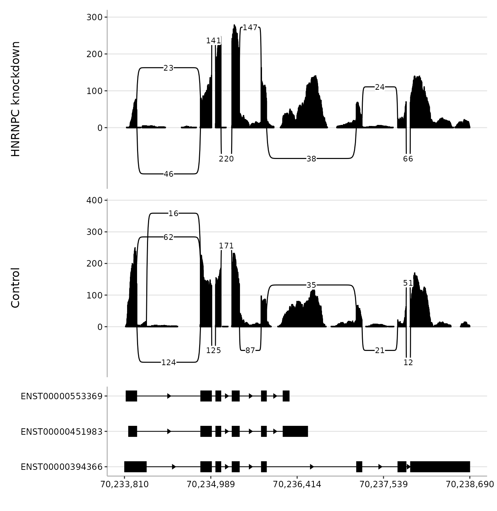

### Styling annotation tracks

Annotation features can be coloured by a metadata column with
`anno_fill_by`. Use `"group"` to colour each transcript or feature group
separately. Specific fill colours can be supplied with
`anno_fill_colours`.

Text labels can be drawn inside annotation features with
`anno_label_by`. The label colour and size are controlled by
`anno_label_colour` and `anno_label_size`. The `min_arrow` argument
controls how wide an annotation intron must be before directional arrows
are drawn.

``` r

spliceTerrain(
    bam = bams,
    region = region,
    annotation = annotation,
    panel_heights = c(2, 2, 1),
    anno_fill_by = "group",
    anno_fill_colours = c(
        ENST00000553369 = "#66C2A5",
        ENST00000394366 = "#8DA0CB",
        ENST00000451983 = "#FC8D62"
    ),
    anno_label_by = "exon_rank",
    anno_label_colour = "black",
    anno_label_size = 2.5,
    min_arrow = 100
)
```

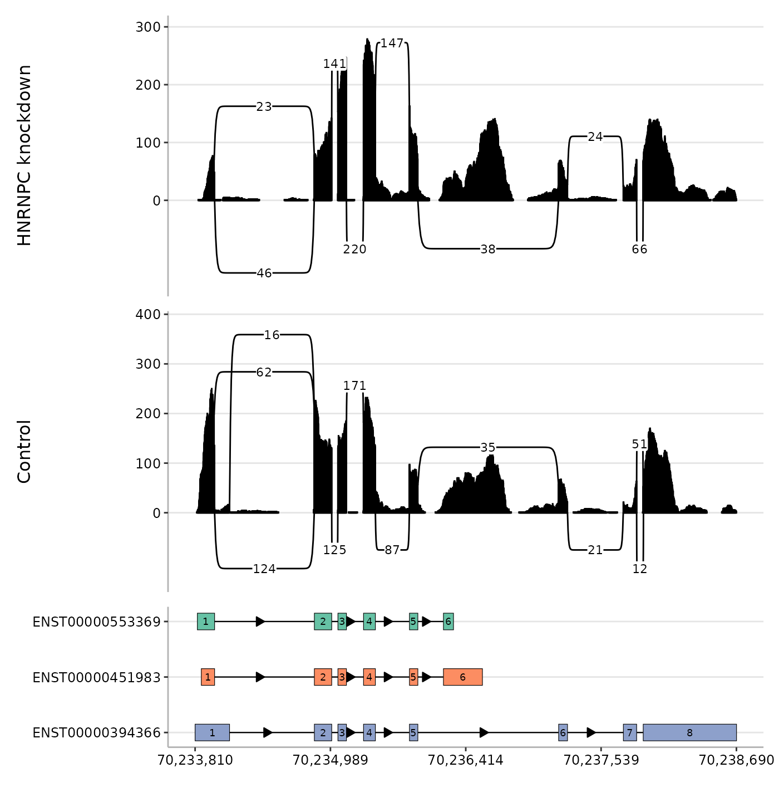

### Highlighting regions of interest

The `highlight` argument marks one or more genomic intervals with shaded
vertical bands. This is useful for drawing attention to a splice site,
variant position, alternative exon, or other feature of interest. The
highlighted interval can be supplied as a character string or as a
`GRanges` object.

``` r

spliceTerrain(
    bam = bams,
    region = region,
    highlight = "chr14:70234854-70234854",
    highlight_colour = "red"
)
```

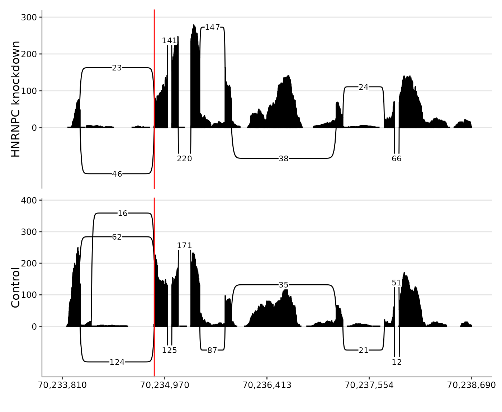

A wider interval can be highlighted with a semi-transparent colour.

``` r

spliceTerrain(
    bam = bams,
    region = region,
    highlight = "chr14:70234056-70234097",
    highlight_colour = scales::alpha("red", 0.2)
)
```

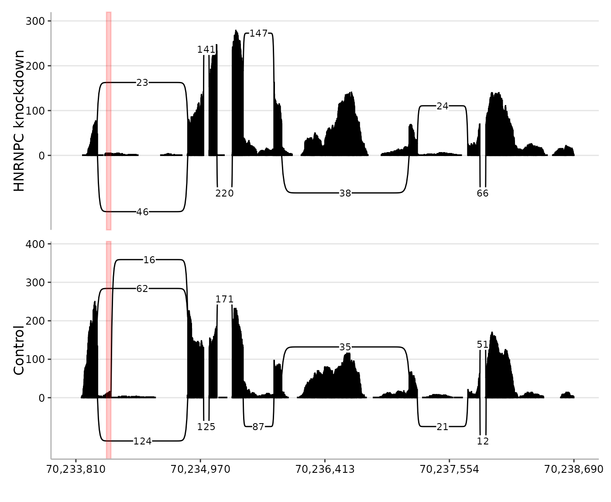

### Percent spliced in labels

Percent spliced in (PSI) is commonly used to summarise how often a
splice choice is used relative to other local splice choices. In
[`spliceTerrain()`](https://baerlachlan.github.io/spliceTerrain/reference/spliceTerrain-methods.md),
the `psi` argument identifies a local genomic interval and labels
junctions whose start or end anchor overlaps that interval. Junction
anchors use intronic coordinates: the start anchor is the first base of
the intron, and the end anchor is the last base of the intron, not the
adjacent exonic bases. The label reports each selected junction’s
fraction of the included junction reads.

This is intended as an interpretable local junction-usage label on the
sashimi plot, rather than full transcript-level isoform inference. By
default, the junction count and PSI percentage are separated by a new
line. Use `psi_label_sep = " "` to display them together on one line.

``` r

spliceTerrain(
    bam = bams,
    region = region,
    psi = "chr14:70234854-70234854",
    psi_label_sep = " "
)
```


### Filtering signal

Three arguments control how much signal is imported and displayed.
`min_mapq` filters alignments by mapping quality during BAM import.
`min_coverage` filters per-base coverage positions before plotting.
`min_junction_reads` filters splice junction arcs by their supporting
read count. The latter two arguments also accept percentage strings such
as `"10%"`. Percentage thresholds are calculated separately for each BAM
relative to its maximum raw coverage or junction count within the
plotting region. When supplying one threshold per BAM, whole-number
counts and percentages can be mixed in a character vector.

``` r

spliceTerrain(
    bam = bams,
    region = region,
    min_mapq = 10,
    min_coverage = 10,
    min_junction_reads = "10%"
)
```

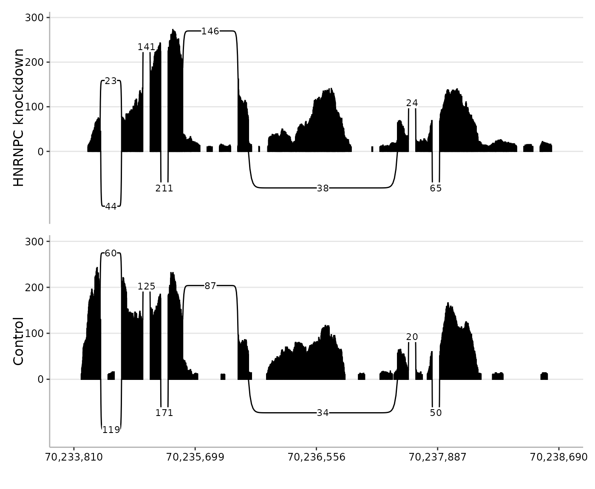

Technical note: `min_coverage` and `min_junction_reads` are applied to
raw counts before any library-size normalisation is applied.

### Stranded RNA-seq data

The `strandedness` argument describes how read strand should be
interpreted. It can be one of `"unstranded"`, `"forward"`, or
`"reverse"`, and can be supplied either as a single value for all BAM
files or one value per BAM file. The example BAM files are unstranded,
so both read orientations contain signal from the transcript.

``` r

spliceTerrain(
    bam = bams,
    region = region,
    strandedness = "unstranded"
)
```


Specifying a stranded protocol for unstranded BAM files filters reads by
strand. As a result, either `"reverse"` or `"forward"` shows only part
of the coverage that is visible when `strandedness = "unstranded"`.

``` r

spliceTerrain(
    bam = bams,
    region = region,
    strandedness = "forward"
)
```

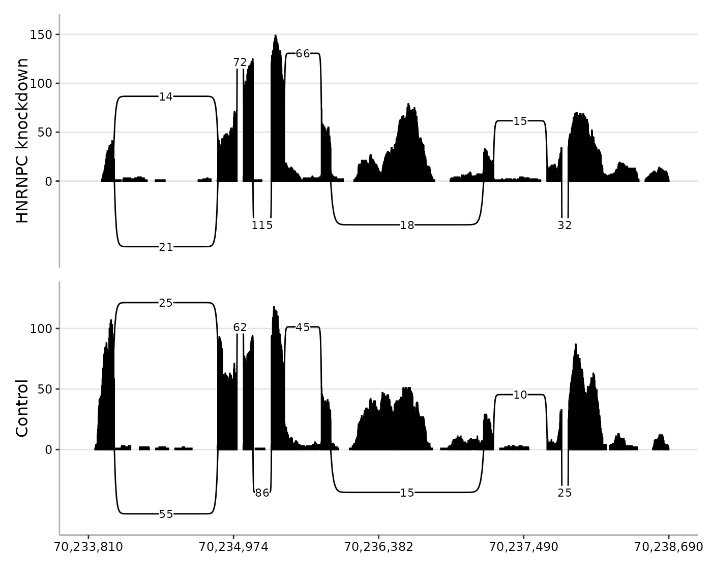

``` r

spliceTerrain(
    bam = bams,
    region = region,
    strandedness = "reverse"
)
```

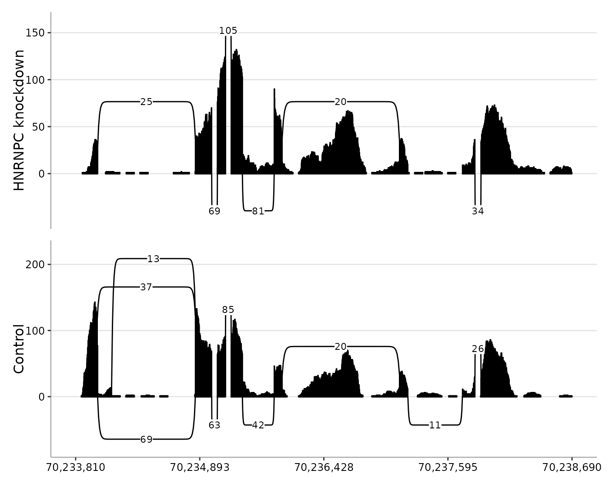

For paired-end BAM files,
[`spliceTerrain()`](https://baerlachlan.github.io/spliceTerrain/reference/spliceTerrain-methods.md)
detects paired-end status from the BAM alignment flags and imports
alignments accordingly. If `region` specifies a strand and
`strandedness` is not `"unstranded"`, alignments are restricted to the
resolved region strand.

### Normalising between samples

When samples have different sequencing depths, coverage and junction
counts can be normalised with `lib_size`. Additional normalisation
factors, such as `edgeR` TMM factors, can be supplied with
`norm_factors`. The effective library size is calculated as
`lib_size * norm_factors`.

By default, counts are normalised to the median effective library size.
Use `normalise_to` to set the target explicitly. The `common_y` argument
is useful when comparing samples because it puts sample panels on the
same y-axis scale.

``` r

spliceTerrain(
    bam = bams,
    region = region,
    lib_size = c(40e6, 55e6),
    norm_factors = c(0.95, 1.08),
    normalise_to = 50e6,
    common_y = TRUE
)
```

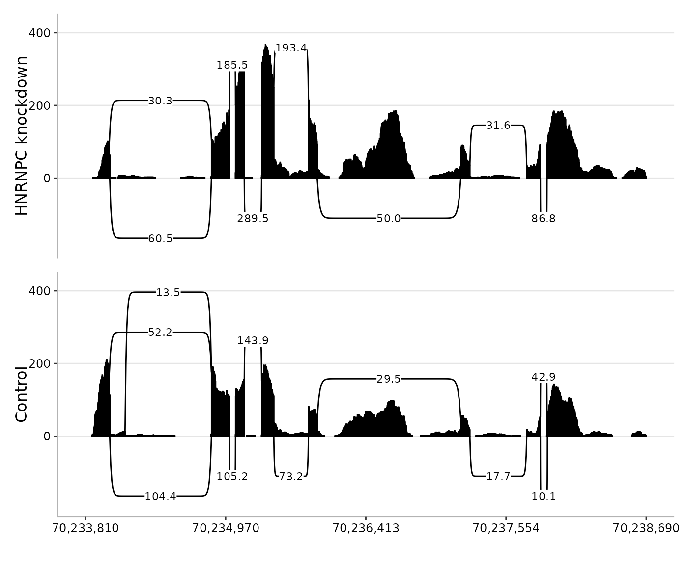

### Compressed genomic layouts

By default, `compress_introns = TRUE` compacts large uninformative gaps
so the plot focuses on observed signal. The `intron_width` argument
controls the approximate width of compacted introns in plot space.

``` r

spliceTerrain(
    bam = bams,
    region = region,
    compress_introns = TRUE,
    intron_width = 500
)
```

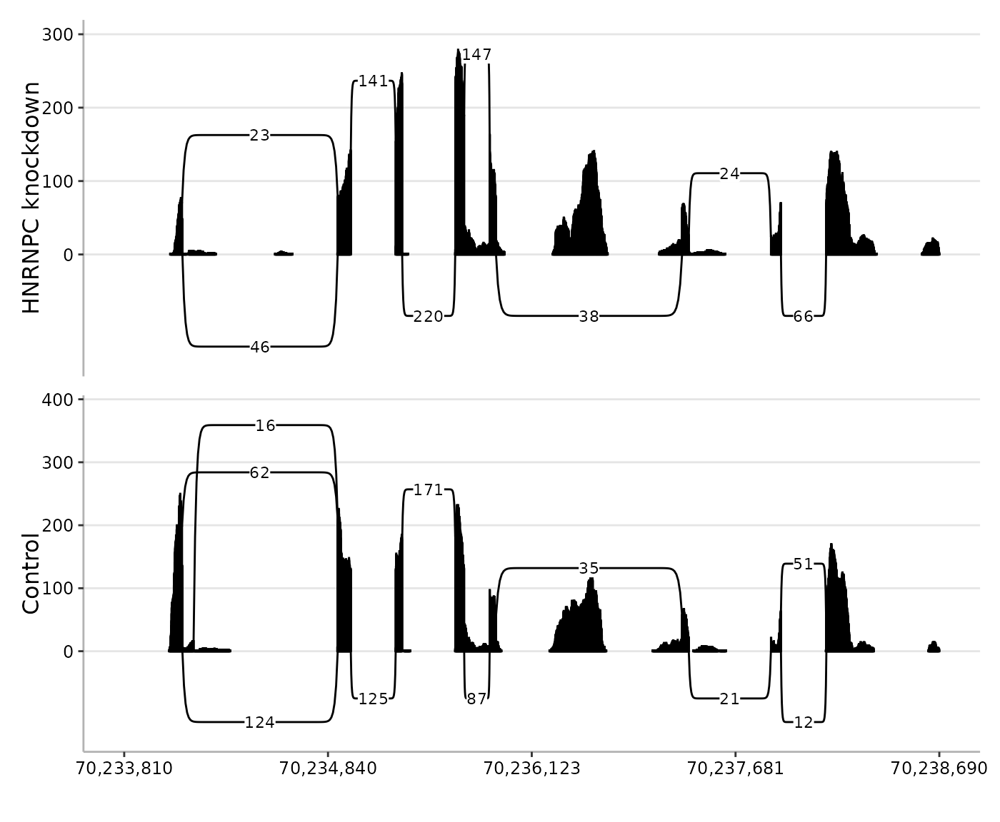

If exact genomic distances are more important than compact display,
intron compression can be disabled.

``` r

spliceTerrain(
    bam = bams,
    region = region,
    compress_introns = FALSE
)
```

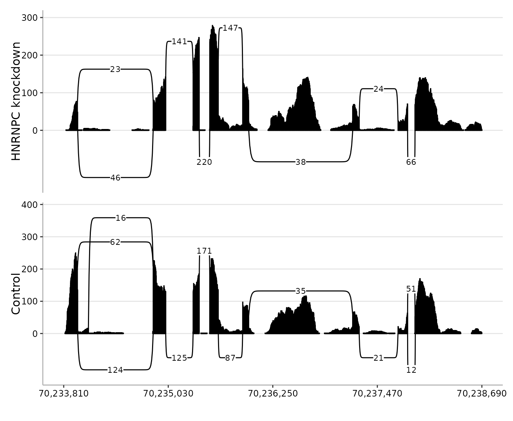

### Junction arc display

Junction arcs can be tuned with `arc_height`, `arc_side`, and
`arc_scale`. Increasing `arc_height` gives stacked arcs more vertical
separation. The `arc_side` argument controls whether arcs are drawn
above, below, or on both sides of the coverage track. When
`arc_scale = TRUE`, arc line width is scaled by junction read count
after filtering. Junction label size is controlled with
`junc_text_size`.

``` r

spliceTerrain(
    bam = bams,
    region = region,
    psi = "chr14:70234854-70234854",
    arc_height = 2,
    arc_side = "above",
    arc_scale = TRUE,
    junc_text_size = 2.5
)
```

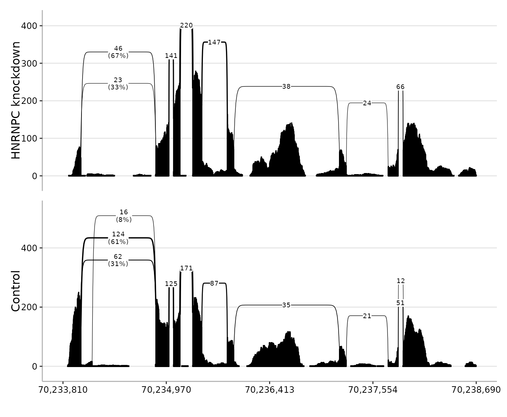

### Sample colours and panel layout

The `colours` argument controls the colours used for sample coverage and
junction arcs. It can be a single colour used for all samples or one
colour per BAM file.

Axis text sizes can be adjusted with `axis_title_size` and
`axis_text_size`.

``` r

spliceTerrain(
    bam = bams,
    region = region,
    annotation = annotation,
    colours = c("darkblue", "darkred"),
    panel_heights = c(2, 2, 1),
    axis_title_size = 20,
    axis_text_size = 12
)
```

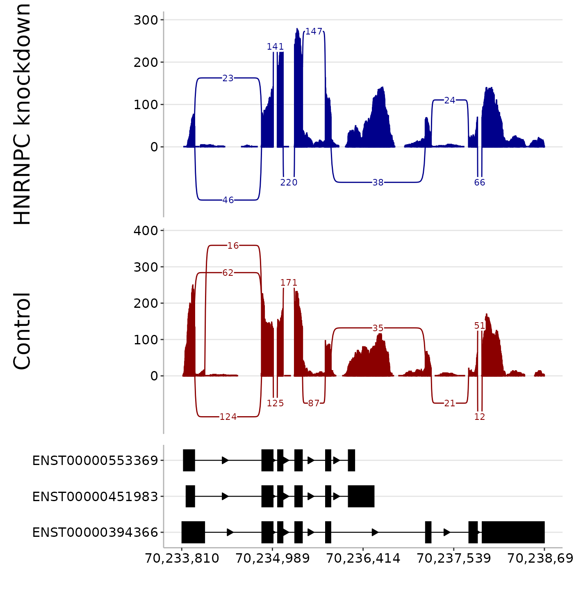

### Returning and reusing plot data

Most users can work directly with the final plot returned by
[`spliceTerrain()`](https://baerlachlan.github.io/spliceTerrain/reference/spliceTerrain-methods.md).
For advanced workflows, set `return_ctx = TRUE` to return the processed
context instead. This contains the validated inputs, imported
alignments, summarised coverage, junction counts, mapped plot-space
data, and plot settings.

``` r

ctx <- spliceTerrain(
    bam = bams,
    region = region,
    return_ctx = TRUE
)

names(ctx)
#> [1] "input" "plot"
names(ctx$plot)
#> [1] "cov"        "juncs"      "map"        "annotation" "region"     "psi"        "highlight"  "plist"
```

The context can be passed back with the `ctx` argument to redraw the
plot without re-importing BAM files or recalculating coverage and
junctions. For example, the processed junctions can be filtered further
before plotting.

``` r

ctx$plot$juncs <- ctx$plot$juncs[ctx$plot$juncs$coverage >= 20]
spliceTerrain(ctx = ctx)
```

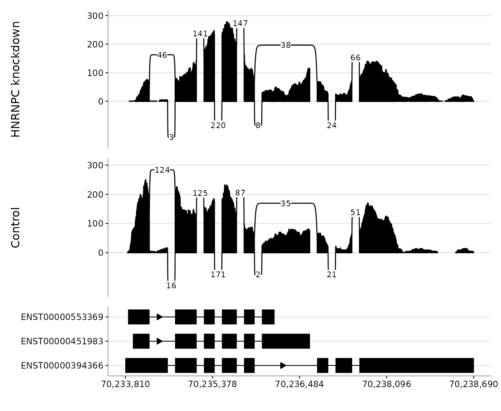

## Session information

``` r

sessionInfo() |>
    pander()
```

**R Under development (unstable) (2026-06-21 r90185)**

**Platform:** x86_64-pc-linux-gnu

**locale:** *LC_CTYPE=C.UTF-8*, *LC_NUMERIC=C*, *LC_TIME=C.UTF-8*,
*LC_COLLATE=C.UTF-8*, *LC_MONETARY=C.UTF-8*, *LC_MESSAGES=C.UTF-8*,
*LC_PAPER=C.UTF-8*, *LC_NAME=C*, *LC_ADDRESS=C*, *LC_TELEPHONE=C*,
*LC_MEASUREMENT=C.UTF-8* and *LC_IDENTIFICATION=C*

**attached base packages:** *stats4*, *stats*, *graphics*, *grDevices*,
*utils*, *datasets*, *methods* and *base*

**other attached packages:** *GenomeInfoDb(v.1.48.0)*,
*pander(v.0.6.6)*, *scales(v.1.4.0)*, *EnsDb.Hsapiens.v75(v.2.99.0)*,
*ensembldb(v.2.36.1)*, *AnnotationFilter(v.1.36.0)*,
*GenomicFeatures(v.1.64.0)*, *AnnotationDbi(v.1.74.0)*,
*Biobase(v.2.72.0)*, *GenomicRanges(v.1.64.0)*, *Seqinfo(v.1.2.0)*,
*IRanges(v.2.46.0)*, *S4Vectors(v.0.50.1)*, *BiocGenerics(v.0.58.1)*,
*generics(v.0.1.4)*, *RNAseqData.HNRNPC.bam.chr14(v.0.50.0)*,
*spliceTerrain(v.0.99.0)* and *BiocStyle(v.2.40.0)*

**loaded via a namespace (and not attached):** *tidyselect(v.1.2.1)*,
*dplyr(v.1.2.1)*, *farver(v.2.1.2)*, *blob(v.1.3.0)*,
*Biostrings(v.2.80.1)*, *S7(v.0.2.2)*, *bitops(v.1.0-9)*,
*lazyeval(v.0.2.3)*, *fastmap(v.1.2.0)*, *RCurl(v.1.98-1.19)*,
*GenomicAlignments(v.1.48.0)*, *XML(v.3.99-0.23)*, *digest(v.0.6.39)*,
*lifecycle(v.1.0.5)*, *ProtGenerics(v.1.44.0)*, *KEGGREST(v.1.52.2)*,
*RSQLite(v.3.53.3)*, *magrittr(v.2.0.5)*, *compiler(v.4.7.0)*,
*rlang(v.1.3.0)*, *sass(v.0.4.10)*, *tools(v.4.7.0)*, *yaml(v.2.3.12)*,
*rtracklayer(v.1.72.0)*, *knitr(v.1.51)*, *labeling(v.0.4.3)*,
*S4Arrays(v.1.12.0)*, *htmlwidgets(v.1.6.4)*, *bit(v.4.6.0)*,
*curl(v.7.1.0)*, *DelayedArray(v.0.38.2)*, *RColorBrewer(v.1.1-3)*,
*abind(v.1.4-8)*, *BiocParallel(v.1.46.0)*, *withr(v.3.0.3)*,
*desc(v.1.4.3)*, *grid(v.4.7.0)*, *ggplot2(v.4.0.3)*,
*SummarizedExperiment(v.1.42.0)*, *cli(v.3.6.6)*, *rmarkdown(v.2.31)*,
*crayon(v.1.5.3)*, *ragg(v.1.5.2)*, *otel(v.0.2.0)*, *httr(v.1.4.8)*,
*rjson(v.0.2.23)*, *DBI(v.1.3.0)*, *cachem(v.1.1.0)*,
*parallel(v.4.7.0)*, *BiocManager(v.1.30.27)*, *XVector(v.0.52.0)*,
*restfulr(v.0.0.17)*, *matrixStats(v.1.5.0)*, *vctrs(v.0.7.3)*,
*Matrix(v.1.7-5)*, *jsonlite(v.2.0.0)*, *bookdown(v.0.47)*,
*patchwork(v.1.3.2)*, *bit64(v.4.8.2)*, *systemfonts(v.1.3.2)*,
*jquerylib(v.0.1.4)*, *glue(v.1.8.1)*, *pkgdown(v.2.2.1)*,
*codetools(v.0.2-20)*, *gtable(v.0.3.6)*, *UCSC.utils(v.1.8.0)*,
*BiocIO(v.1.22.0)*, *tibble(v.3.3.1)*, *pillar(v.1.11.1)*,
*htmltools(v.0.5.9)*, *R6(v.2.6.1)*, *textshaping(v.1.0.5)*,
*evaluate(v.1.0.5)*, *lattice(v.0.22-9)*, *png(v.0.1-9)*,
*Rsamtools(v.2.28.0)*, *cigarillo(v.1.2.1)*, *memoise(v.2.0.1)*,
*bslib(v.0.11.0)*, *Rcpp(v.1.1.2)*, *SparseArray(v.1.12.2)*,
*xfun(v.0.60)*, *fs(v.2.1.0)*, *MatrixGenerics(v.1.24.0)* and
*pkgconfig(v.2.0.3)*
